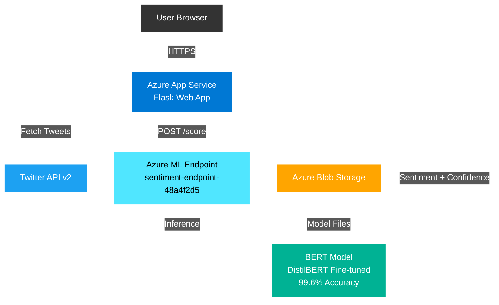

# Twitter Sentiment Analysis Bot

A production-ready sentiment analysis system for Twitter data, powered by **Azure Machine Learning** and **BERT (DistilBERT)** deep learning models. Built for research and real-time social media analytics.


## Features

- **Real-time Twitter Analysis** - Fetch and analyze tweets for any search query
- **BERT Deep Learning** - Fine-tuned DistilBERT model with **99.6% accuracy**
- **Modern Web Interface** - Dark theme UI with interactive visualizations
- **Azure Cloud Architecture** - Scalable deployment on Azure App Service + Azure ML
- **Multiple ML Models** - BERT, Logistic Regression, SVM, Naive Bayes
- **Interactive Charts** - Sentiment distribution, timeline analysis, and statistics

## Architecture




## Prerequisites

- **Python 3.11 or 3.12** (Not 3.13 - tweepy compatibility issue)
- **Azure Account** with active subscription
- **Twitter API Bearer Token** (Twitter Developer Account)
- **Git** for version control

## Quick Start

### 1. Clone the Repository

```bash
git clone https://github.com/sahilcmd3/twitter-sentiment-analyzer-azureml.git
cd twitter-sentiment-analyzer-azureml
```

### 2. Create Virtual Environment

```bash
python -m venv .venv

# Windows
.venv\Scripts\activate

# Mac/Linux
source .venv/bin/activate
```

### 3. Install Dependencies

```bash
pip install -r requirements.txt
```

### 4. Configure Environment Variables

Copy `.env.example` to `.env` and fill in your credentials:

```env
# Twitter API
TWITTER_BEARER_TOKEN=your_twitter_bearer_token
TWITTER_API_KEY=your_twitter_api_key
TWITTER_API_SECRET=your_twitter_api_secret

# Azure ML Configuration
AZURE_SUBSCRIPTION_ID=your_subscription_id
AZURE_RESOURCE_GROUP=your_resource_group
AZURE_WORKSPACE_NAME=your_workspace_name
AZURE_ENDPOINT_NAME=your_endpoint_name
AZURE_ML_ENDPOINT=https://your-endpoint.centralindia.inference.ml.azure.com/score
AZURE_ML_API_KEY=your_azure_ml_api_key

# App Settings
FLASK_ENV=development
PORT=5000
```

### 5. Run Locally

```bash
python main.py
```

Access the application at: **http://localhost:5000**

## Azure Deployment

### Deploy Azure ML Endpoint

1. **Update configuration** in `deploy_to_azureml.py` or set environment variables
2. **Run deployment script:**

```bash
python deploy_to_azureml.py
```

This will:
- Create Azure ML workspace
- Deploy BERT model as managed endpoint
- Configure autoscaling (Standard_DS2_v2 instance)

### Deploy Flask Web App to Azure App Service

**Option 1: Azure Portal (Recommended)**

Follow the step-by-step guide: [`AZURE_APP_SERVICE_DEPLOYMENT.md`](AZURE_APP_SERVICE_DEPLOYMENT.md)

**Option 2: Automated Script**

```bash
python configure_webapp.py
```

**Option 3: VS Code Extension**

1. Install Azure App Service extension
2. Right-click on project folder
3. Select "Deploy to Web App"
4. Configure environment variables in Azure Portal

### Get Endpoint Keys

Retrieve your Azure ML API keys:

```bash
python get_endpoint_keys.py
```

## Testing

### Test Azure ML Endpoint

```bash
python test_deployment.py
```

### Test REST API with cURL

```bash
# Analyze tweets
curl -X POST http://localhost:5000/api/analyze \
  -H "Content-Type: application/json" \
  -d '{"query": "artificial intelligence", "max_tweets": 50}'

# Analyze custom text
curl -X POST http://localhost:5000/api/analyze-text \
  -H "Content-Type: application/json" \
  -d '{"text": "This is an amazing product!"}'

# Get model info
curl http://localhost:5000/api/model-info
```

## Project Structure

```
twitter-sentiment-analyzer-azureml/
├── app/
│   ├── __init__.py                  # Flask app factory
│   ├── core/
│   │   ├── sentiment_analyzer.py    # Multi-model sentiment analysis (BERT/ML/TextBlob)
│   │   ├── text_preprocessing.py    # NLP text preprocessing
│   │   ├── twitter_collector.py     # Twitter API v2 integration
│   │   └── visualizer.py            # Chart generation and statistics
│   ├── routes/
│   │   ├── api_routes.py            # REST API endpoints
│   │   └── main_routes.py           # Web UI routes
│   ├── templates/
│   │   └── index.html               # Frontend interface
│   └── models/                      # Pre-trained models (Git ignored)
│       ├── bert_sentiment/          # Fine-tuned BERT model
│       ├── best_model.pkl           # Traditional ML model
│       └── vectorizer.pkl           # TF-IDF vectorizer
├── scripts/
│   ├── train_bert.py                # BERT training pipeline
│   ├── train_models.py              # Traditional ML training
│   ├── test_bert_integration.py     # BERT testing
│   └── test_twitter_api.py          # Twitter API testing
├── data/
│   ├── sentiment140.csv             # Training dataset (Git ignored)
│   └── model_comparison.csv         # Model performance metrics
├── main.py                          # Application entry point
├── requirements.txt                 # Python dependencies
├── environment.yml                  # Conda environment (Azure ML)
├── score.py                         # Azure ML inference script
├── deploy_to_azureml.py            # Azure ML deployment automation
├── get_endpoint_keys.py            # Retrieve Azure ML API keys
├── test_deployment.py               # Test Azure ML endpoint
├── configure_webapp.py              # Azure App Service configuration
├── download_models.py               # Download models from blob storage
├── .env.example                     # Environment variables template
├── .gitignore                       # Git ignore rules
├── LICENSE                          # MIT License
└── README.md                        # This file
```

## API Endpoints

| Endpoint | Method | Description | Parameters |
|----------|--------|-------------|------------|
| `/` | GET | Web interface | - |
| `/api/analyze` | POST | Analyze tweets | `query`, `max_tweets` |
| `/api/analyze-text` | POST | Analyze custom text | `text` |
| `/api/model-info` | GET | Get model information | - |
| `/api/twitter-status` | GET | Check Twitter API status | - |
| `/api/stats` | GET | Get API statistics | - |

### Example Request

```json
POST /api/analyze
{
  "query": "python programming",
  "max_tweets": 50
}
```

### Example Response

```json
{
  "status": "success",
  "query": "python programming",
  "using_ml_model": true,
  "model_method": "BERT",
  "stats": {
    "total_tweets": 50,
    "positive": 35,
    "negative": 5,
    "neutral": 10,
    "avg_confidence": 0.92
  },
  "visualizations": {
    "sentiment_distribution": "base64_image",
    "timeline": "base64_image"
  },
  "sample_tweets": [...]
}
```

## Environment Variables

| Variable | Description | Required | Example |
|----------|-------------|----------|---------|
| `TWITTER_BEARER_TOKEN` | Twitter API v2 bearer token | Yes | `AAAAAAAAAAAAAAAAAAAAAxxxxx...` |
| `TWITTER_API_KEY` | Twitter API key | Optional | `mzO5XoxakPQDBFTT5lkxd7HwZ` |
| `TWITTER_API_SECRET` | Twitter API secret | Optional | `TN5eXHXUp0xxnnM4gVQCxM1sl...` |
| `AZURE_SUBSCRIPTION_ID` | Azure subscription ID | Yes | `48a4f2d5-f9d4-4c14-b1ca-...` |
| `AZURE_RESOURCE_GROUP` | Azure resource group | Yes | `sentiment-ml-rg` |
| `AZURE_WORKSPACE_NAME` | Azure ML workspace name | Yes | `sentiment-analysis-workspace` |
| `AZURE_ENDPOINT_NAME` | Azure ML endpoint name | Yes | `sentiment-endpoint-48a4f2d5` |
| `AZURE_ML_ENDPOINT` | Azure ML scoring URI | Yes | `https://sentiment-endpoint...` |
| `AZURE_ML_API_KEY` | Azure ML API key | Yes | `F7NCfD4lONJLLzMLXGpKfYfaa...` |
| `FLASK_ENV` | Flask environment | No | `development` or `production` |
| `PORT` | Application port | No | `5000` |

## Model Performance

### BERT (DistilBERT) - Production Model

| Metric | Score |
|--------|-------|
| **Accuracy** | **99.6%** |
| **Precision** | 0.996 |
| **Recall** | 0.996 |
| **F1-Score** | 0.996 |
| **Training Dataset** | Sentiment140 (1.6M tweets) |
| **Training Time** | ~4 hours (GPU) |
| **Inference Time** | ~50ms per tweet |

### Traditional ML Models (Comparison)

| Model | Accuracy | Precision | Recall | F1-Score |
|-------|----------|-----------|--------|----------|
| **BERT (DistilBERT)** | **99.6%** | **0.996** | **0.996** | **0.996** |
| Logistic Regression | 78.2% | 0.782 | 0.782 | 0.782 |
| SVM | 77.8% | 0.778 | 0.778 | 0.778 |
| Naive Bayes | 75.5% | 0.755 | 0.755 | 0.755 |
| TextBlob (Baseline) | ~65% | - | - | - |

## Azure Cost Estimation

| Resource | Tier/SKU | Monthly Cost (USD) | Notes |
|----------|----------|-------------------|-------|
| **Azure App Service** | B1 Basic (1 Core, 1.75GB RAM) | ~$13 | Can use F1 Free tier for testing |
| **Azure ML Endpoint** | Standard_DS2_v2 (2 cores, 7GB RAM) | ~$125 | 24/7 uptime |
| **Azure Blob Storage** | Standard LRS | ~$0.10 | Model files storage |
| **Bandwidth** | Outbound data transfer | ~$5-10 | Depends on usage |
| **Total (Estimated)** | | **~$138-148/month** | Production deployment |

### Cost Optimization Tips

- **Use F1 Free tier** for App Service during development ($0)
- **Stop ML endpoint** when not in use (save ~$125/month)
- **Use local BERT model** instead of Azure ML endpoint for testing
- **Set up auto-scaling** to scale down during low traffic
- **Monitor usage** with Azure Cost Management

### Free Tier Options

- Azure App Service: F1 Free (1GB RAM, 60 min/day compute)
- Azure ML: Free tier workspace (limited compute hours)
- Azure Storage: First 5GB free

## Tech Stack

**Backend:**
- Python 3.11
- Flask 3.0.0
- Transformers (Hugging Face)
- PyTorch
- Tweepy (Twitter API v2)
- Pandas, NumPy, Matplotlib

**ML Models:**
- BERT (DistilBERT) - Fine-tuned
- Scikit-learn (Logistic Regression, SVM, Naive Bayes)
- TextBlob (Fallback)

**Cloud Infrastructure:**
- Azure App Service (Web hosting)
- Azure Machine Learning (Model deployment)
- Azure Blob Storage (Model storage)

**Frontend:**
- HTML5, CSS3, JavaScript
- Chart.js (Visualizations)
- Dark theme with neon accents

## Troubleshooting

### Common Issues

**1. ModuleNotFoundError: No module named 'imghdr'**
```bash
# Python 3.13 removed imghdr module
# Solution: Use Python 3.11 or 3.12, or upgrade tweepy
pip install --upgrade tweepy
```

**2. Azure ML returns string instead of dict**
```python
# Already fixed in api_routes.py
# Response is now properly parsed with json.loads()
```

**3. Twitter API authentication fails**
```bash
# Check bearer token in .env file
# Ensure Twitter Developer account is active
# Verify API v2 access is enabled
```

**4. BERT model not loading locally**
```bash
# Check if model files exist
ls app/models/bert_sentiment/

# Download models if missing
python download_models.py
```

**5. Azure ML endpoint timeout**
```bash
# Increase timeout in api_routes.py
timeout=60  # Default is 30 seconds
```

## Documentation

- [Azure App Service Deployment Guide](AZURE_APP_SERVICE_DEPLOYMENT.md)
- [Twitter API v2 Documentation](https://developer.twitter.com/en/docs/twitter-api)
- [Hugging Face Transformers](https://huggingface.co/docs/transformers)
- [Azure Machine Learning Docs](https://learn.microsoft.com/en-us/azure/machine-learning/)

## Contributing

Contributions are welcome! Please follow these steps:

1. **Fork** the repository
2. **Create** a feature branch
   ```bash
   git checkout -b feature/amazing-feature
   ```
3. **Commit** your changes
   ```bash
   git commit -m 'Add amazing feature'
   ```
4. **Push** to the branch
   ```bash
   git push origin feature/amazing-feature
   ```
5. **Open** a Pull Request

### Development Guidelines

- Follow PEP 8 style guide for Python
- Add unit tests for new features
- Update documentation for API changes
- Test locally before submitting PR

## License

This project is licensed under the **MIT License** - see the [LICENSE](LICENSE) file for details.

## Authors & Contributors

- **[@sahilcmd3](https://github.com/sahilcmd3)** - *Initial development, model training & Azure deployment*
- **Aryan** - *Research*

## Acknowledgments

- [Sentiment140 dataset](http://help.sentiment140.com/) by Stanford University
- [Hugging Face](https://huggingface.co/) for Transformers library
- [Microsoft Azure](https://azure.microsoft.com/) for cloud infrastructure
- [Twitter](https://developer.twitter.com/) for API access
- [Flask](https://flask.palletsprojects.com/) web framework

## Roadmap

- [ ] Add **Azure Cosmos DB** for analysis history persistence
- [ ] Implement **real-time streaming** with Twitter Streaming API
- [ ] Add **multi-language support** (multilingual BERT)
- [ ] Create **mobile app** interface (Flutter/React Native)
- [ ] Add **user authentication** and API keys
- [ ] Implement **rate limiting** and Redis caching
- [ ] Add **sentiment trends** over time analysis
- [ ] Export results to **CSV/Excel**
- [ ] Add **batch processing** for large datasets
- [ ] Integrate **additional social media** platforms (Reddit, Instagram)
